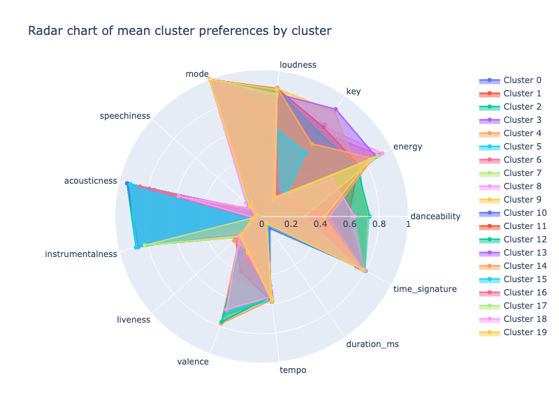

# Unsupervised ML: Spotify playlists clustering 

Moosic is an innovative start-up where playlists are not just lists of songs, but carefully curated experiences. Created by a team of music aficionados well-versed in both timeless classics and contemporary trends, these playlists resonate with a unique vibe and style. 

Subscribers have the luxury of enjoying these playlists on their preferred streaming services, including Spotify, Apple Music, and Youtube Music. What makes Moosic stand out is the personal touch in every playlist, each embodying a distinct mood or genre.

However, as the company is rapidly growing, the challenge has become the pace at which our music experts can produce new playlists. To address this, Moosic is exploring the realm of Data Science.

For the initial phase, we are aiming for a prototype - understanding that this is just the beginning of a journey towards refinement and discovery. Working alongside our music experts, you will help us explore two critical questions:

* Do Spotify's audio features have the capability to identify "similar songs" in the way humans perceive similarity across genres like rock ballads, operas, or drum & bass?
* Is K-Means an effective method for creating playlists, or should we explore other algorithms or methods in our playlist creation process?

## The objective

The obejective of this project is to introduce a level of automation to the playlist creation process while maintaining the essence that makes our playlists special.

Your mission is to apply a basic clustering algorithm, such as K-Means, to categorize these songs into distinctive groups, which will then form the foundation of new playlists.

## Project's Folder Structure

This project is organized into several directories, each serving a specific purpose. Below is the structure and description of these directories:

- `/docs`: This directory contains the final presentation for the project.

- `/src`: Inside this folder, you will find the  Jupiter Notebook.

- `/plots`: This directory houses all the plots generated as part of this project. 

## Calculating KMean

Our first step involves cleansing the data. Initially, the dataset comprised 5,235 songs, but after the elimination of duplicates, the total was reduced to 5,114 songs.

The dataset from Spotify includes various audio features. Among these, some are classic musical attributes like key, mode, and tempo. Additionally, unique metrics devised by Spotify's Data Science and Sound Engineering team, such as danceability, energy, and valence, are present.

Contained within this dataset are the following musical features:

* acousticness
* danceability
* duration_ms
* energy
* instrumentalness
* key
* liveness
* loudness
* mode
* speechiness
* tempo
* time_signature
* valence

The subsequent stage entails selecting a Scaler. In this project, MinMaxScaler() will be employed for data normalization. Nonetheless, RobustScaler() demonstrated comparable outcomes. 

To determine the optimal number of clusters, we utilized the Elbow and Silhouette methods, which indicated that around 20 clusters would be ideal.

Additionally, obtaining an API key from Spotify would enable the development of an application that can directly organize clusters within your Spotify account.

# Findings

* K-Means clustering algorithm demonstrated its effectiveness in segmenting our dataset into distinct, meaningful groups.
* The optimal number of clusters for this particular dataset seems to be around 20, as it provides the highest silhouette score, indicating a better structure and separation between the clusters.
* Using a machine to create playlist is time and cost effective, however, the results are far from replacing human capabilities. 
